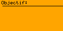

**Objectif :** Pratiquer les tableaux à une dimension

Avec Godot, on simplifie les choses, pas de distinction entre:   
tableau, liste, queue, liste double, ...   
On utilise simplement `Array[]`.

On peut y ajouter, retirer, parcourir des éléments et en connaître la taille.

Pour représenter un écran de 128×64, on utilise un tableau de 8192 bits (valeurs 0 et 1).

**Exercices :**
* Allumer l’écran
* Éteindre l’écran
* Basculer (toggle) l’écran
* Allumer le premier et le dernier pixel
* Allumer la première ligne horizontale de l’écran
* Utiliser `await` pour activer les pixels un par un
* Allumer un pixel sur deux :
  * indices pairs entre 0 et 128
  * indices impairs entre 128 et 256
* Créer un décalage de bits (bit shift) vers la gauche et vers la droite

