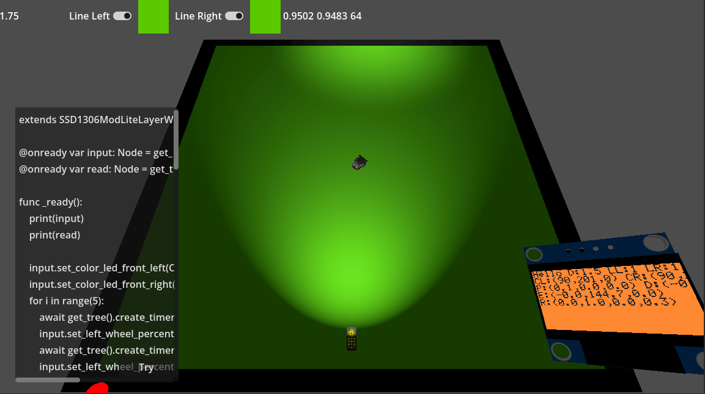

Pour le moement, votre jeu creer un code a qui on donne la voiture du joueur.
Via la methode `func _on_car_received(car_node: Node):`
https://github.com/ryoaspi/ToolCarsGodot/blob/DEV/_Main/Gist/FR/hello_world.gd
```gdscript
extends Node
func _ready() -> void:
	pass 
func _process(delta: float) -> void:
	pass
func _on_car_received(car_node: Node):
	print("🚗 Car connected to KS4036 node!")
	print("📦 Attached node: ", car_node)
```


C'est pas necessairement la meilleur des solutions pour le modding.
Mais dans un projet dont on ne sais pas comment le code peu evoluer. 
Ca passe bien.


De mon coter sur mon projet a moi.
J ai aucune idee quel code sera le meiller dans l avenir de mon outils.
Ce que j ai donc fait, cest deux classe de relay.


Input Relay qui se charge de donner au jouer la possibliter d interagir avec la voiture.


```gdscript

class_name SensorKs4036InputRelay
extends Node
static var instance_in_scene: SensorKs4036InputRelay = null
static func get_instance():
	return instance_in_scene

signal on_joystick_input_received(input_joystick: Vector2)
signal on_wheels_input_received(left_percent: float, right_percent: float)
signal on_wheels_motors_input_received(top_left: bool, top_right: bool, bottom_left: bool, bottom_right: bool)
signal on_color_led_front_left_updated(color: Color)
signal on_color_led_front_right_updated(color: Color)

func _ready() -> void:
	instance_in_scene = self

func _exit_tree() -> void:
	instance_in_scene = null

func clamp_percent(percent: float) -> float:
	return clamp(percent, -1.0, 1.0)

#region Joystick Input
@export_group("Joystick Input")
@export var last_joystick_input: Vector2 = Vector2.ZERO
func set_input_with_array(input_joystick: Vector2) -> void:
	var stick = Vector2(clamp_percent(input_joystick.x), clamp_percent(input_joystick.y))
	last_joystick_input = stick
	on_joystick_input_received.emit(stick)
#endregion

#region Wheels Percent Power Input
@export_group("Wheels Input")
@export var last_wheel_left_percent_11: float = 0.0
@export var last_wheel_right_percent_11: float = 0.0

func set_left_wheel_percent_11(percent: float) -> void:
	set_wheels_percent_11(percent, last_wheel_right_percent_11)
func set_right_wheel_percent_11(percent: float) -> void:
	set_wheels_percent_11(last_wheel_left_percent_11, percent)
func set_wheels_percent_11(left_percent: float, right_percent: float) -> void:
	last_wheel_left_percent_11 = clamp_percent(left_percent)
	last_wheel_right_percent_11 = clamp_percent(right_percent)
	on_wheels_input_received.emit(last_wheel_left_percent_11, last_wheel_right_percent_11)
#endregion

#region MOTORS INPUT
@export_group("Motors Input")
@export var last_top_left_motor: bool = false
@export var last_top_right_motor: bool = false
@export var last_down_left_motor: bool = false
@export var last_down_right_motor: bool = false

func set_wheels_motors(top_left: bool, top_right: bool, bottom_left: bool, bottom_right: bool) -> void:
	last_top_left_motor = top_left
	last_top_right_motor = top_right
	last_down_left_motor = bottom_left
	last_down_right_motor = bottom_right
	on_wheels_motors_input_received.emit(top_left, top_right, bottom_left, bottom_right)

func set_top_left_motor_button(set_motor_on: bool) -> void:
	set_wheels_motors(set_motor_on, last_top_right_motor, last_down_left_motor, last_down_right_motor)

func set_top_right_motor_button(set_motor_on: bool) -> void:
	set_wheels_motors(last_top_left_motor, set_motor_on, last_down_left_motor, last_down_right_motor)

func set_down_left_motor_button(set_motor_on: bool) -> void:
	set_wheels_motors(last_top_left_motor, last_top_right_motor, set_motor_on, last_down_right_motor)

func set_down_right_motor_button(set_motor_on: bool) -> void:
	set_wheels_motors(last_top_left_motor, last_top_right_motor, last_down_left_motor, set_motor_on)
#endregion

#region LEDs Color
@export_group("LEDs Color")
@export var last_color_led_front_left: Color = Color(0, 0, 0)
@export var last_color_led_front_right: Color = Color(0, 0,0)

func set_color_led_front_left(color: Color) -> void:
	last_color_led_front_left = color
	on_color_led_front_left_updated.emit(color)

func set_color_led_front_right(color: Color) -> void:
	last_color_led_front_right = color
	on_color_led_front_right_updated.emit(color)

#endregion
```


Et pour la lecture. ReadSensor qui lui donne les donnes de bases de la KS4036.
- Y a t il un ligne a gauche et a droite
- la diance frontal
- L intensiter de la lumiere a gauche et a droite
- Une detection de couleur  gauche droite
- La capaciter de mettre la courant a on off
- La direction central des roues

Le moteur y est pas car  c est l input.

Si la voiture recoit un signal lumineur.
Elle emeter un  `light_integer_command:int` depuis sont signal.


```gdscript
## Set by the game developer, they are sensors your have on the KS4036 robot in real life.
## value are not the same as in real life.
## us static get_instacncence() or use $%NodeName to access it.
class_name  SensorKs4036ReadSensors
extends Node


static var instance_in_scene: SensorKs4036ReadSensors = null
static func get_instance():
	return instance_in_scene

## Car has a infrared listener.
## The lib of the KS4036 turn then to integer to facilitate the learning.
signal on_infrared_light_message_received(light_integer_command: int)

@export var line_sensor_left_found_line: bool = false
@export var line_sensor_right_found_line: bool = false

@export var ultrasonic_distance_meter: float = 0.0

@export var light_intensity_left: float = 0.0
@export var light_intensity_right: float = 0.0

@export var line_sensor_left_color_detected: Color = Color(0, 0, 0)
@export var line_sensor_right_color_detected: Color = Color(0, 0, 0)

@export var is_power_switch_on: bool = true


@export var center_wheels_direction_forward: Node3D


func _ready() -> void:
	instance_in_scene = self


func _exit_tree() -> void:
	instance_in_scene = null


func notify_line_sensor_left_as(left_on: bool) -> void:
	line_sensor_left_found_line = left_on

func notify_line_sensor_right_as(right_on: bool) -> void:
	line_sensor_right_found_line = right_on


func notify_ultrasonic_distance_in_meter(distance: float) -> void:
	ultrasonic_distance_meter = distance


func notify_light_intensity_left(left_intensity: float) -> void:
	light_intensity_left = left_intensity

func notify_light_intensity_right(right_intensity: float) -> void:
	light_intensity_right = right_intensity


func notify_infrared_light_message_received(light_integer_command: int) -> void:
	on_infrared_light_message_received.emit(light_integer_command)

func notify_center_wheels_direction_node(center_wheels_direction_forward_node: Node3D) -> void:
	center_wheels_direction_forward = center_wheels_direction_forward_node

func notify_color_line_sensor_left_as(color:Color):
	self.line_sensor_left_color_detected = color

func notify_color_line_sensor_right_as(color:Color):
	self.line_sensor_right_color_detected = color


func is_left_line_on() -> bool:
	return line_sensor_left_found_line

func is_right_line_on() -> bool:
	return line_sensor_right_found_line

func get_front_distance_in_meter() -> float:
	return ultrasonic_distance_meter

func get_light_intensity_left() -> float:
	return light_intensity_left

func get_light_intensity_right() -> float:
	return light_intensity_right

func get_color_line_left() -> Color:
	return line_sensor_left_color_detected

func get_color_line_right() -> Color:
	return line_sensor_right_color_detected

func is_power_on() -> bool:
	return is_power_switch_on


func get_global_position() -> Vector3:
	if center_wheels_direction_forward:
		return center_wheels_direction_forward.global_transform.origin
	return Vector3.ZERO

func get_global_forward_direction() -> Vector3:
	if center_wheels_direction_forward:
		return -center_wheels_direction_forward.global_transform.basis.z.normalized()   
	return Vector3.FORWARD

func get_global_quaternion() -> Quaternion:
	if center_wheels_direction_forward:
		return Quaternion.from_euler(center_wheels_direction_forward.global_transform.basis.get_euler())
	return Quaternion.IDENTITY

func get_global_euler_rotation() -> Vector3:
	if center_wheels_direction_forward:
		return center_wheels_direction_forward.global_transform.basis.get_euler()
	return Vector3.ZERO


```

 
En gros cette facon de faire. Me permet d etre stable dans le temps.  
Peu importe comment mon projet evolue dans l avenir, ces deux scripts on peut de chance de change.  
Et donc la documentation du jeu restera stable.  
  
Trouvers SensorKs4036ReadSensors et SensorKs4036InputRelay  
Puis utilisez les.  


Voila ce que ce la peu donner:
[](https://www.youtube.com/watch?v=BnndejesWyA)  
https://www.youtube.com/watch?v=BnndejesWyA  


``` gdscript

extends SSD1306ModLiteLayerWithTagName

@onready var input: Node = get_tree().root.find_child("KS4036Input", true, false)
@onready var read: Node = get_tree().root.find_child("KS4036Read", true, false)

func _ready():
	print(input)
	print(read)

	input.set_color_led_front_left(Color.RED)
	input.set_color_led_front_right(Color.BLUE)
	for i in range(5):
		await get_tree().create_timer(2).timeout
		input.set_left_wheel_percent_11(1)
		await get_tree().create_timer(2).timeout
		input.set_left_wheel_percent_11(1)


func append_layer(array_128x64: Array[bool]) -> void:
	array_128x64.fill(false)
	var text: String = "Hello "

	var distance: float = read.get_front_distance_in_meter()
	var is_on_line_left: bool = read.is_left_line_on()
	var is_on_line_right: bool = read.is_right_line_on()

	var color_left: Color = read.get_color_line_left()
	var color_right: Color = read.get_color_line_right()

	var light_left = read.get_light_intensity_left()
	var light_right = read.get_light_intensity_right()

	text += "D:%0.1f LL:%d LR:%d LSL:%d LSR:%d" % [
		distance,
		int(is_on_line_left),
		int(is_on_line_right),
		light_left,
		light_right
	]

	# Convert colors into something human-readable (since raw Color is useless in text)
	text += " \nCL:(%d,%d,%d) CR:(%d,%d,%d)" % [
		int(color_left.r * 255.0),
		int(color_left.g * 255.0),
		int(color_left.b * 255.0),
		int(color_right.r * 255.0),
		int(color_right.g * 255.0),
		int(color_right.b * 255.0)
	]
	
	var position: Vector3 = read.get_global_position()
	var direction: Vector3 = read.get_global_forward_direction()
	var euler: Vector3 = read.get_global_euler_rotation()
	var rotation: Quaternion = read.get_global_quaternion()

	text += "\nP:(%0.1f,%0.1f,%0.1f) D:(%0.2f,%0.2f,%0.2f)" % [
		position.x, position.y, position.z,
		direction.x, direction.y, direction.z
	]

	text += "\nE:(%0.1f,%0.1f,%0.1f)" % [
		rad_to_deg(euler.x), rad_to_deg(euler.y), rad_to_deg(euler.z)
	]

	text += "\nR:(%0.1f,%0.1f,%0.1f,%0.1f)" % [
		rotation.x, rotation.y, rotation.z, rotation.w
	]
	

	E13ScreenBuilderPrint6x8.print_text_6x8_at_lrtd(
		array_128x64,
		Vector2(0, 0),
		text,
		true,
		true
	)
```