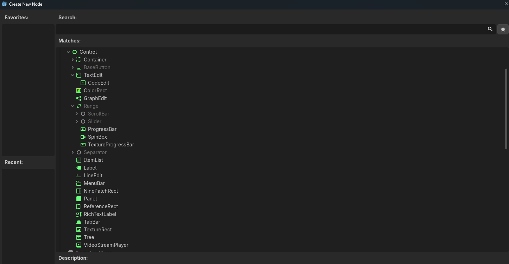

# Félicitations

Bon bah déjà, félicitations 😄  

Vous avez rocké du poney 😁

Votre toolbox contient une voiture avec :
- deux LEDs, un capteur de distance et un laser
- elle bouge avec des inputs XR ou non-XR
- vous pouvez récupérer une micro:bit et la déposer sur la voiture
- on peut charger le code d'un étudiant avec un code de chargement
  - et depuis un scan
- ...

Il reste deux ou trois scripts à assembler. 
Mais vous y êtes 🪄

Tout ça en pratiquant sur un GitHub commun avec des branches 😄  

Franchement,
GG 👏

-----------------
# Toolbox ?

Savoir faire une boîte à outils réutilisable de projet en projet, c’est ultra important dans les entreprises de service.  
(Un peu moins dans le gaming, car on ne crée pas 30 à 40 projets par an comme dans l’applicatif.)  

Les boîtes à outils internes à une société, c’est ce qui vous rend compétitif dans l’industrie.

Maintenant, faire une boîte à outils qui ne casse pas et où l’on se sent à l’aise…  
Ça, c’est un autre défi 😄  
D’où cet exercice.

Votre faux client pour cette jam, je vous l’avais annoncé au début de cet atelier.  
C’est de permettre d’apprendre la programmation via une simulation de Robotarium en utilisant un KS4036.  

Le but étant qu’un élève puisse transférer ses connaissances apprises en VR vers la vraie vie.

  
[📼 Vidéo](https://www.youtube.com/watch?v=5CaVhGTG8eA)

- Doc : https://www.robotarium.gatech.edu
- Channel : https://www.youtube.com/channel/UC95etX3555MyNyOjoWHKFXg

Comme dit au début de la semaine, faites attention au code que vous créez.  
Car vous allez devoir l’utiliser, voire l’entretenir durant la jam.

C’est le défi de cet atelier.

-------------------------------

# Les artistes du coup ?

Ce que l’on a fait cette semaine, c’est préparer l’aspect **technique**:

- Utiliser une greybox de la voiture (ici avec mes `.zip`)
  - En aucun cas ce que je vous ai passé n’est valide pour un client.
    - C’est de la 3D, des UV et des textures de merde 😄
    - Remplacez mes modèles avec un travail de réel artistes
- Avoir une voiture qui bouge
  - Avec des inputs humains
  - Avec des inputs des moddeurs
- Avoir un code d’étudiant qui peut être chargé dans le casque
- Découvrir ce qu’est le modding et comment ça fonctionne
- ...

Ce semaine de preparation technique.
C’est quelque chose qui m’arrive trop souvent.

Vous savez que le projet est prévu dans 12 mois.
Mais le client prend 6 mois à valider.

Puis les équipes se mettent en place pendant 2 mois en attendant la validation.

Il vous reste donc 4 mois pour faire le projet.
Mais dans ces 4 mois, le code doit être prêt dès le premier mois pour laisser de la place aux artistes, au son et au peaufinage.

En gros, vous travaillez dans le vide des mois à l’avance pour ne pas être pris de court quand le projet commence réellement.

 -> C'est ce que l'on vient de faire pour la jam qui arrive.

Niveau artistique et game design,tout reste à faire.

Que ce soit :
- un jeu AR ou VR
- un jeu de parcours
- un jeu de battle
- un jeu de ferme 😉
- un jeu asymétrique avec un humain
- un jeu d’essaim
- un jeu type Adibou
- un Agar.io
- ...

Il y a :
- des décors
- l’aspect graphique de la voiture
- l’aspect des mains et de l’interface pour jouer à votre jeu
- des menus pour les interactions
- des contrôleurs avec une gueule stylisée à l’image du jeu
- des personnages si vous voulez créer un jeu avec des PNJ
- des particules, des sons si vous voulez explorer des sujets qu’on n’a pas encore explorés
- ...

En gros 😄, il y a du taf.  
rester simple.  

Notez que les artistes viennent d’avoir un cours sur les animations.  
Donc une UI 3D animée et "juicy" 🪄🧙‍♂️ ?

Vous avez 3 jours.  
Moins un jour, car vous devez builder, filmer, publier, vérifier, tester…

Sachez `scoper` la taille de votre jam.

Un jeu de jam de 48h, ça peut prendre 6 à 12 mois (Beat Saber) pour être finalisé et publié sur le store.  
Voire 3 à 7 ans pour Guillaume 😋  
Et 3 à 4 ans pour Thomas Van Bouwel 😉

Ma citation préférée pour la création de boîtes à outils et cette jam de 14 à 21 heures :

> EN — "Any intelligent fool can make things bigger, more complex, and more violent. It takes a touch of genius — and a lot of courage — to move in the opposite direction."
>
> FR — "N’importe quel imbécile intelligent peut rendre les choses plus grandes, plus complexes et plus violentes. Il faut une touche de génie — et beaucoup de courage — pour aller dans la direction opposée."

_Je n’arrive pas à la respecter, mais je fais de mon mieux._

Essayez de ne pas compter sur la quantité d’assets, mais sur la simplicité que permet la XR.  

→ KISS & Scope

---------------

--------------------

# Contexte de la Jam

Pour moi, une game jam ne doit pas être un portfolio, car cela casse la créativité et bride la volonté de R&D.  

Mais chaque jam finit toujours par se retrouver dans votre portfolio en images et en vidéos.  
_Voir, une fois sur 1000, un jeu sur le store ultra célèbre, simplement parce qu’il est unique._

Comme m’a dit Nicolas, vous avez envie — et besoin — de pouvoir montrer et exposer vos compétences, et d’en être fiers après la jam.  
Et Nico, ainsi que d’autres, auront sûrement cette volonté.

J’ai littéralement fait plus de 100 jams/hackathons, et j’ai exploré les trois aspects de cette problématique.  
Je laisse le groupe décider de votre volonté sur ce sujet.  
C’est votre choix de groupe.

Dans tous les cas, il vous faudra avoir un build fonctionnel, des photos et une vidéo vendredi prochain sur Itch.io.

---

## **Je ne suis pas les autres formateurs**

On a 6 à 20 formateurs différents, qui ont des sources de revenus et des clients différents.  

Cherif et Maude vous forment pour l’industrie du jeu vidéo AAA et indé, destinée aux magasins en ligne.  
Ce n’est pas mon domaine, donc je ne peux pas vous former à cela.

Tout ce que je peux vous partager, c’est mon expérience sur le terrain avec l’industrie du jeu vidéo de service.

- pour les commerciaux
- pour le marketing
- pour les musées
- pour la recherche et développement
- pour des applications :
  - scientifiques
  - éducatives
  - universitaires
- pour un agriculteur de campagne
- une école de drones
- un forestier
- des apiculteurs
- des architectes
- ...

C’est toujours une question :
- d’un **besoin concret**
- de courtes périodes de développement
- de petits budgets
- de nombreux projets sur l’année
- de projets qui se ressemblent sans jamais être les mêmes
- d’un rush constant en équipe de 1 à 4 personnes maximum

Voir :
- [Poolpio](https://poolpio.com)
- [ActiveMe](https://www.activeme.be)
- [Art Team](https://www.art-team.fr)
- [Drag On Slide](https://www.walloniedesign.be/interview/drag-on-slide/)
- [One Bonsai](https://onebonsai.com)
- [XR Intelligence](https://xrintelligence.io)
- [Team Panoptes](https://teampanoptes.be)
- Voir aussi Brotaru, GameCom, Café Numérique, Meet & Build...
- ...

Contrairement au gaming, dans cette industrie, ce n’est pas un beau portfolio qui compte.  
C’est la preuve que vous arrivez à finir un projet dans un court laps de temps, sans que ce soit moche, et en respectant **le besoin** du client.  

Surtout en soulageant une **pain** chez le client.

> Faites la jam comme vous le désirez, tant que vous respectez le besoin du faux client lié à la thématique.

____________

# Thématique : Godotarium

Les conditions de la thématique : **Godotarium**
- Avoir un jeu pour apprendre à coder sur le Quest
- Utiliser votre boîte à outils de cette semaine

Inspirez-vous du concept de Robotarium 🍻  
Nul besoin d’être *le* Robotarium.

Le reste, c’est vous qui choisissez.

# Vous aimez la thématique de la jam ?

La thématique de la jam ne vient pas de nulle part.

Si vous allez à la [LUDOVIA#BE](https://ludovia.be) à Spa :

  
https://ludovia.be

Vous constaterez qu’une grosse partie des stands est consacrée à l’apprentissage ludique de la programmation dans les écoles et centres de formation.

Et 80 % utilisent des librairies Python et des applications personnalisables par les enseignants.

Ces applications ont aussi de la télémétrie (souvent demandée dans les projets clients) pour avoir un historique, des certifications et/ou des données en live de l’apprenant.

Si vous cherchez un stage dans ce domaine, vous pouvez contacter :
- [Art Team](https://www.art-team.fr)
- [Pascal Balancier](https://www.linkedin.com/in/pascalbalancier/)
- [Jérôme Marciniak](https://www.linkedin.com/in/jeromemarciniak/)
- [Céline Colas](https://www.linkedin.com/in/célinecolas/)
- [CoderDojo Belgium](https://coderdojobelgium.be/fr)
- L’équipe de [Hack&Wow](https://www.hacknwow.be)
  - Aucun lien avec Warcraft 😋 cette fois
- L’équipe de [Museomix](https://museomix.org)
- Voir aussi [TUMO Liège](https://www.jeunesse-ardente.be/article/tumo-liege/)
- Aller au [FOSDEM](https://fosdem.org/2026/)

Avec l’arrivée des IA sur le marché, vous avez un océan de *vibe coders* qui savent coder vite et bien… mais pas toujours loin 😅

On a donc besoin de cours ludiques qui enseignent les bases de la programmation et des algorithmes à ceux qui n’ont pas les moyens de faire des études de gestion.

Et comme la matière est parfois chiante à mourir, il faut trouver des moyens ludiques de faire passer la matière 😄

Il existe évidemment déjà des tonnes de compagnies et plateformes sur le marché :
- https://leekwars.com
- https://www.codingame.com/start/
- https://python.microbit.org/v/3
- https://makecode.microbit.org/#editor
- https://www.codedex.io
- https://www.codecademy.com
- https://www.boot.dev
- https://codecombat.com
- https://brilliant.org
- ...

___________________________

# Vendredi 29

> Tester, solidifier, retirer.

En gros : finir une version stable de votre boîte à outils.  
Et vous allez utiliser `YAML` avec `GitHub Actions` sur le `main` pour automatiser vos releases.

  
  
https://youtu.be/mfv0V1SxbNA?t=2227

En gros, il ne faut pas que ce soit parfait.  
Mais une boîte à outils, ça finit chez le client.

Donc il ne faut pas que ce soit un château de cartes impossible à reconstruire si ça casse.

> Posez-vous la question : ai-je peur de mon code ?  
> Si oui, il faut travailler le sujet.

---

## Lundi 1 juin

On pratique les Nodes UI 2D de Godot.

---

## Mardi 2

On prend le temps de regarder et pratiquer les 200 Nodes.

---

Si vous voyez des thématiques dont on pourrait avoir besoin durant la jam,  
proposez-les-moi avant le week-end.  
On y consacrera du temps.

---

## YML

Voir [YML](YML.md)

---

## Gist

Voir [Gist](Gist.md)
