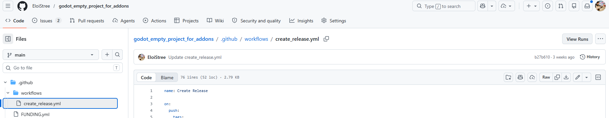
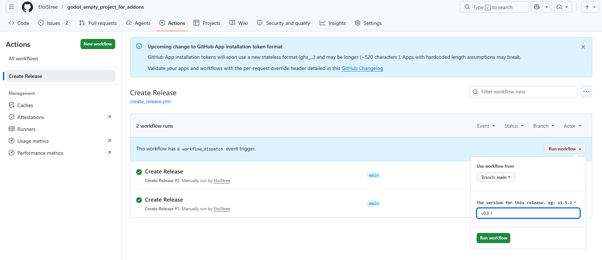
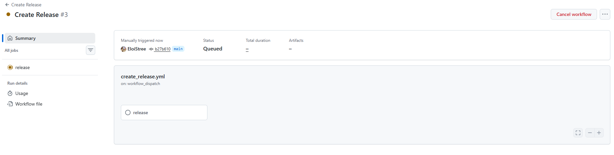
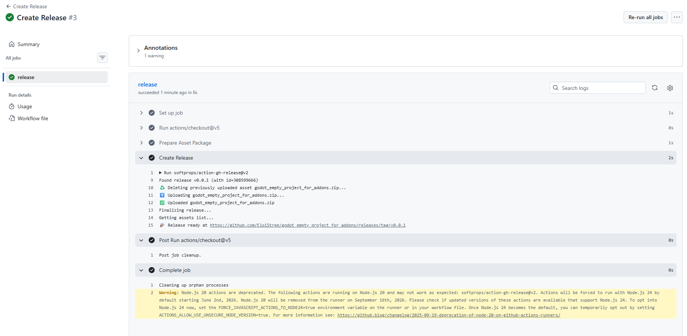
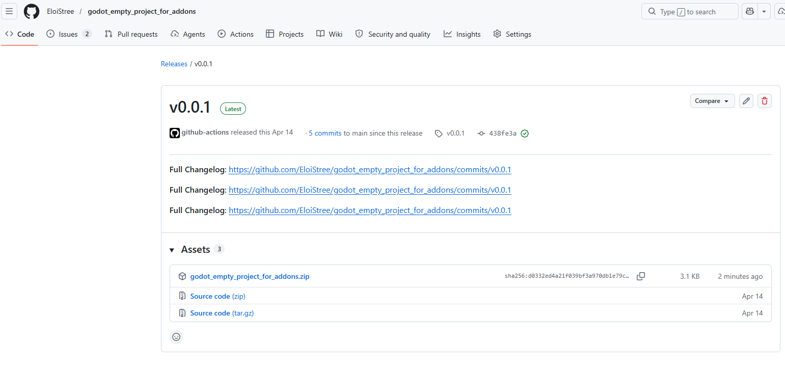
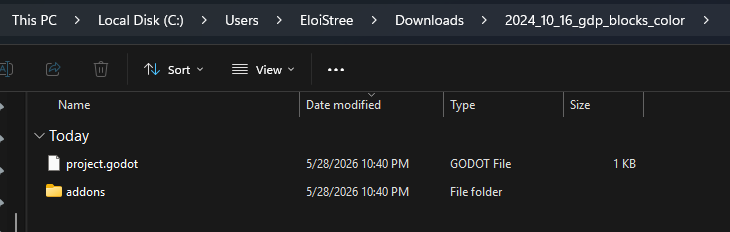
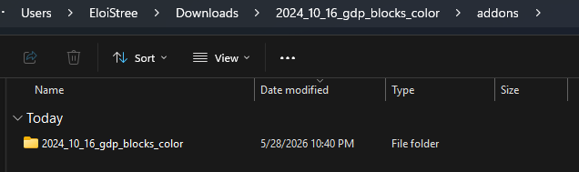
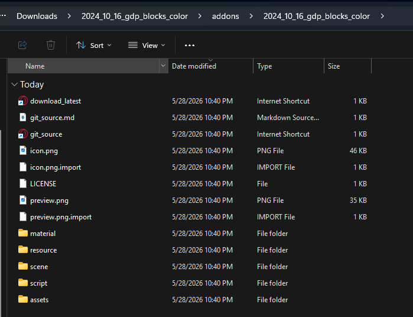

Le fichier `.yml` permet d’exécuter des lignes de commande console avec GitHub Actions.

Ici, on va l’utiliser pour publier automatiquement un fichier ZIP de notre addon dans un projet Godot vide.
Je me suis inspiré de :

* [https://github.com/addmix/godot_aerodynamic_physics](https://github.com/addmix/godot_aerodynamic_physics)
* [https://github.com/addmix/godot_aerodynamic_physics/blob/7adf96eb7daada41626f0cb82a9a8c3eb9f96fc2/.github/workflows/create_release.yml](https://github.com/addmix/godot_aerodynamic_physics/blob/7adf96eb7daada41626f0cb82a9a8c3eb9f96fc2/.github/workflows/create_release.yml)

Quand vous publiez sur la Godot Library, vous ne fournissez pas le dossier GitHub,
mais un projet vide contenant votre addon.

Pour créer rapidement notre projet, on va le cloner depuis ce dépôt Git que j’ai créé :
[https://github.com/EloiStree/godot_empty_project_for_addons](https://github.com/EloiStree/godot_empty_project_for_addons)

*Créez le vôtre si vous ne voulez pas dépendre de mes conventions de projet.*

Pour que le fichier `.yml` fonctionne, vous devez le mettre dans le répertoire :

```text
.github/workflows
```

Appelons-le `create_release.yml`.

Cela vous donnera ceci avec un petit bouton `View Runs`.



Cela ouvre une fenêtre où exécuter notre workflow.



Entrez le tag de votre release, puis appuyez sur `Run workflow`.

Cela peut prendre un peu de temps, car GitHub crée une machine virtuelle Linux pour exécuter votre code.



Si tout se passe bien, vous devriez voir votre release dans l’onglet `Releases` de votre dépôt.



Avec un joli lien vers la nouvelle release :
[https://github.com/EloiStree/godot_empty_project_for_addons/releases/tag/v0.0.1](https://github.com/EloiStree/godot_empty_project_for_addons/releases/tag/v0.0.1)



Code source :
[https://github.com/EloiStree/godot_empty_project_for_addons/blob/main/.github/workflows/create_release.yml](https://github.com/EloiStree/godot_empty_project_for_addons/blob/main/.github/workflows/create_release.yml)

Si vous téléchargez le ZIP, cela ressemble à ceci :
[https://github.com/EloiStree/2024_10_16_gdp_blocks_color/releases/tag/v0.0.1](https://github.com/EloiStree/2024_10_16_gdp_blocks_color/releases/tag/v0.0.1)





```ini
[InternetShortcut]
URL=https://github.com/EloiStree/2024_10_16_gdp_blocks_color/releases/latest/download/2024_10_16_gdp_blocks_color.zip
```


# Regardons au code du yml pour comprendre ce qu’il fait.

> ⚠️ Code degelasse qui meriterait d'etre refactoré, mais qui fonctionne pour le moment. Je le partage tel quel pour que vous puissiez l'utiliser et l'adapter à votre projet. 
``` yml
name: Create Release

on:
  push:
    tags:
      - "v*.*.*"
  workflow_dispatch:
    inputs:
      tag:
        description: 'The version for this release. eg: v1.5.2'
        required: true
        type: string

permissions:
  contents: write
 
## DONT REMOVE
## INSPIRATION: https://github.com/addmix/godot_aerodynamic_physics/blob/7adf96eb7daada41626f0cb82a9a8c3eb9f96fc2/.github/workflows/create_release.yml
jobs:
  release:
    runs-on: ubuntu-latest

    steps:
      - uses: actions/checkout@v5
        with:
          ref: main

      - name: Prepare Asset Package
        run: |


          [ -d .git ] && rm -r .git/
          [ -d docs ] && rm -r docs
          [ -f README.md ] && rm README.md
          find . -name "*.blend" -type f -delete
          find . -name "*.blend.import" -type f -delete

          

          mkdir -p ../${{ github.event.repository.name }}_temp/addons/${{ github.event.repository.name }}
          mv {.,}* ../${{ github.event.repository.name }}_temp/addons/${{ github.event.repository.name }}
          
          echo -e "${{ github.event.repository.html_url }}" > ../${{ github.event.repository.name }}_temp/addons/${{ github.event.repository.name }}/git_source.md
          echo -e "[InternetShortcut]\nURL=${{ github.event.repository.html_url }}" > ../${{ github.event.repository.name }}_temp/addons/${{ github.event.repository.name }}/git_source.url
          echo -e "[InternetShortcut]\nURL=https://github.com/${{ github.repository_owner }}/${{ github.event.repository.name }}/releases/latest/download/${{ github.event.repository.name }}.zip\n" > ../${{ github.event.repository.name }}_temp/addons/${{ github.event.repository.name }}/download_latest.url

          mv ../${{ github.event.repository.name }}_temp/addons ../${{ github.event.repository.name }}

          
          cd ..


          git clone https://github.com/EloiStree/godot_empty_project_for_addons.git godot_empty_project_temp
          [ -f godot_empty_project_temp/README.md ] && rm godot_empty_project_temp/README.md          
          [ -d godot_empty_project_temp/.git ] && rm -rf godot_empty_project_temp/.git
          [ -d godot_empty_project_temp/.github ] && rm -rf godot_empty_project_temp/.github
          
          
          cp -r godot_empty_project_temp/. ${{ github.event.repository.name }}/
          rm -rf godot_empty_project_temp

          find "${{ github.event.repository.name }}/" -type d -name ".github" -exec rm -rf {} +
         
          cd ${{ github.event.repository.name }}/

          zip -r ../${{ github.event.repository.name }}.zip ./*
    
      - name: Create Release
        uses: softprops/action-gh-release@v2
        with:
          files: ../${{ github.event.repository.name }}.zip
          generate_release_notes: true
          tag_name: ${{ inputs.tag }}
          draft: false
```


On n’a pas besoin du `.git` dans le zip, donc on le supprime.
`[ -d .git ] && rm -r .git/`

Dans un dépôt Git, il est conseillé d’avoir un dossier `docs`.
Mais on n’en a pas besoin dans le zip, donc on le supprime.
`[ -d docs ] && rm -r docs`

C’est un projet Godot. Pas besoin d’un README à la racine du projet, donc on le supprime.
`[ -f README.md ] && rm README.md`

Les fichiers Blender servent à la création, pas à l’utilisation.
Donc on les retire.
Surtout que les fichiers Blender nécessitent Blender sur la machine de l’utilisateur.
`find . -name "*.blend" -type f -delete`
`find . -name "*.blend.import" -type f -delete`

Créons un dossier temporaire pour y mettre notre addon.
`mkdir -p ../${{ github.event.repository.name }}_temp/addons/${{ github.event.repository.name }}`

On déplace tout le contenu du projet Git dans ce dossier temporaire.
`mv {.,}* ../${{ github.event.repository.name }}_temp/addons/${{ github.event.repository.name }}`

J’aime bien avoir, dans mon dossier `addons`, un fichier qui indique où trouver le dépôt Git source.
`echo -e "${{ github.event.repository.html_url }}" > ../${{ github.event.repository.name }}_temp/addons/${{ github.event.repository.name }}/git_source.md`

J’aime bien aussi, sous Windows, pouvoir simplement cliquer sur un fichier `.url` 😉
`echo -e "[InternetShortcut]\nURL=${{ github.event.repository.html_url }}" > ../${{ github.event.repository.name }}_temp/addons/${{ github.event.repository.name }}/git_source.url`

Si j’ai besoin de télécharger la dernière version du dépôt, je préfère avoir une URL qui pointe vers la dernière release.
`echo -e "[InternetShortcut]\nURL=https://github.com/${{ github.repository_owner }}/${{ github.event.repository.name }}/releases/latest/download/${{ github.event.repository.name }}.zip\n" > ../${{ github.event.repository.name }}_temp/addons/${{ github.event.repository.name }}/download_latest.url`

On peut maintenant renommer notre dossier temporaire en dossier permanent avec le nom du dépôt utilisateur.
`mv ../${{ github.event.repository.name }}_temp/addons ../${{ github.event.repository.name }}`

On remonte d’un dossier dans le terminal.
`cd ..`

On ne veut pas créer un projet Godot presque vide : on veut un projet préconfiguré.
Donc on le clone depuis un template.
(Remplace le dépôt Git par le tien.)
`git clone https://github.com/EloiStree/godot_empty_project_for_addons.git godot_empty_project_temp`

On n’a pas besoin du README.
`[ -f godot_empty_project_temp/README.md ] && rm godot_empty_project_temp/README.md`

On n’a pas besoin du `.git` dans le zip, donc on le supprime.
`[ -d godot_empty_project_temp/.git ] && rm -rf godot_empty_project_temp/.git`

On n’a pas besoin du dossier `.github` avec les GitHub Actions dans le zip, donc on le supprime.
`[ -d godot_empty_project_temp/.github ] && rm -rf godot_empty_project_temp/.github`

On copie le projet dans lequel on a commencé à stocker notre addon.
`cp -r godot_empty_project_temp/. ${{ github.event.repository.name }}/`

On supprime le dossier temporaire.
`rm -rf godot_empty_project_temp`

On fait un petit tour pour retirer tous les dossiers `.github` qui traîneraient encore.
`find "${{ github.event.repository.name }}/" -type d -name ".github" -exec rm -rf {} +`

On se déplace dans le dossier du projet Godot pour pouvoir en faire un zip.
`cd ${{ github.event.repository.name }}/`

On indique que tout le contenu du dossier doit être compressé dans un zip portant le nom du dépôt.
`zip -r ../${{ github.event.repository.name }}.zip ./*`


``` yml
     - name: Create Release
        uses: softprops/action-gh-release@v2
        with:
          files: ../${{ github.event.repository.name }}.zip
          generate_release_notes: true
          tag_name: ${{ inputs.tag }}
          draft: false
```

    
`- name: Create Release`  
Creates a workflow step named “Create Release”.  

`uses: softprops/action-gh-release@v2`  
Uses the GitHub Action `softprops/action-gh-release` version 2 to create a GitHub Release.   
That action automates the process of creating a release and uploading assets to it.   
For beginner, it’s a convenient way to publish your project without leaving GitHub.   

`with:`  
Begins the configuration block for the action inputs.  

`files: ../${{ github.event.repository.name }}.zip`
Uploads a ZIP file as a release asset. The file name matches the repository name.  
 
`generate_release_notes: true`  
Automatically generates release notes based on commits, merged PRs, and changes.  

`tag_name: ${{ inputs.tag }}`  
Sets the Git tag for the release using the workflow input named `tag`.  

`draft: false`  
Publishes the release immediately instead of saving it as a draft.  


Et vous voilà le heureux propriétaire d'une release GitHub avec un joli ZIP à télécharger pour les utilisateurs de votre addon Godot !


Dans le cas de notre atelier on a utilisé Godot XR Tool...      
Et les assets du Godot Lib ne doivent pas avoir de dépendance.      
Donc on pourra pas le publier sur le store.     

sauf si on fait split en deux notre projet version XR et version Modding KS4036  
Mais on a pas le temps pour ça.  
Git c'est déjà bien.  