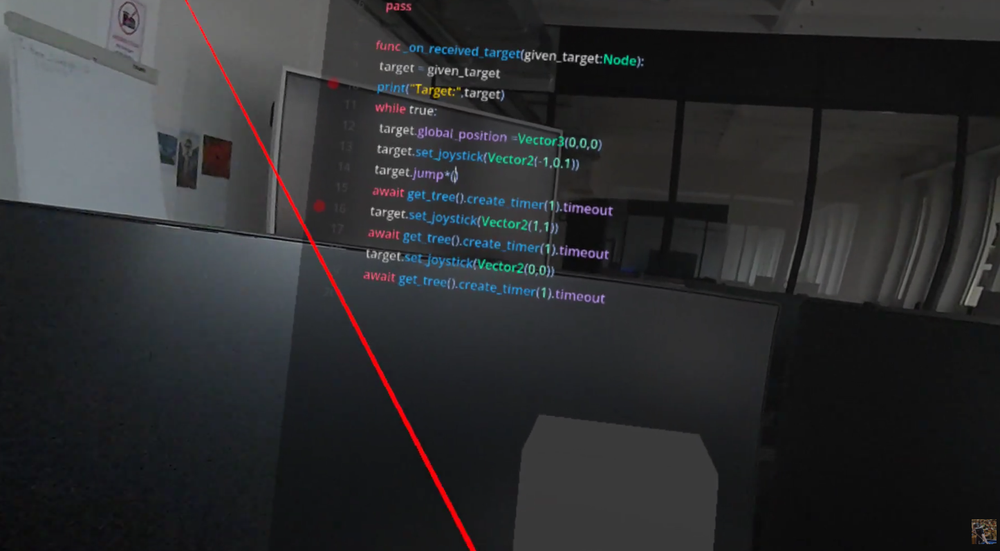
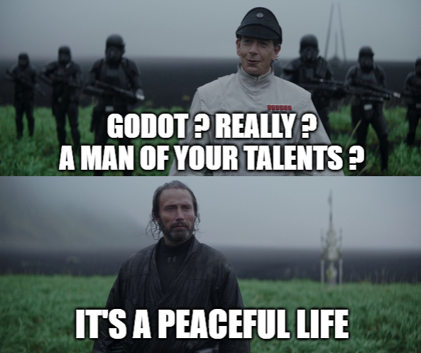

# Préparation technique avant la jam

   
https://www.youtube.com/watch?v=uzxZjqTwqkg   

## Objectifs principaux

* Mettre en place un projet **Godot XR Tools** :
  * aussi stable et fiable que possible 😅
* Configurer un **CodeEdit** ou une interface de développement utilisable.
* Permettre à **Godot XR Tools** de déclencher et contrôler l'UI.
* Maîtriser l'export d'un des deux:
  * APK vers **Quest**
  * **WebXR** sur Quest
* Valider les aspects techniques clés du projet :
  * **Katana** → découpe de mesh (*Mesh Cut*)
  * **Modding** → intégration de **CodeEdit** et du système de modding

## Bonus

* Préparer des notes de référence à partir du cours pour gagner du temps pendant la jam :

  * Input
  * Action Sets
  * Area3D

## À faire avant mercredi

Vous pouvez préparer le dépôt Git avec **Godot XR Tools** déjà configuré et fonctionnel pour mercredi matin.

## Important

L'objectif de cette journée **n'est pas de commencer la jam**.

L'objectif est de s'assurer que vous ne serez pas bloqués par des problèmes techniques pendant la jam.

Prenez le temps d'identifier les éléments techniques dont votre projet pourrait avoir besoin. Et testez les.

Pratiquez le **RTFM** (*Read The Fucking Manual*) et le **LMGTFY** (*Let's me google that for you*) sur ces sujets.

**Que le code soit avec vous.** 🚀

--------------------------------------
🦆  Why not (v) (;..;) (v)  Zoidberg
--------------------------------

# Godot pour la suite ?

Je n'ai pas quitté Unity, je suis allé sur Godot.
J'adore Unity.

C'est difficile de convaincre sur ce que j'ai trouvé dans Godot.
Mais je vais essayer.

Hier, je sirotais ma bière, casque sur la tête, allongé sur le lit d'un Airbnb, pour apprendre un peu ce que j'avais mal fait avec Godot XR.

Et ce que j'y ai trouvé ?

Un GitHub avec du beau code et du beau monde, en train de discuter ensemble sur des pull requests d'amélioration.

Des petits détails que je ne connaissais pas dans l'interface de Godot, qui montraient une volonté de bien faire, une fois que tu sais où chercher.

J'ai dû lire dans les entrailles de l'addon, et j'y ai trouvé des patterns bien utilisés, de la documentation et un code simple à lire, car fait pour être lu.

J'ai testé un addon du store qui faisait des fonctionnalités que je ne pensais pas possibles.

Godot ne sera jamais Unity.
Godot ne concurrencera pas Unreal.
Godot sera toujours en retard sur le marché.

Mais je trouve en Godot une certitude que Blender m'a toujours offerte.

Quand j'en ai besoin, il est là et sera toujours là.

Avec un peu de chance, si je ne meurs pas en chemin, il me reste encore 30 ans de passion à explorer.

Et bien que je ne puisse pas garantir que Godot existera toujours d'ici là, j'ai une bonne certitude qu'il sera encore présent.

J'ai même la certitude que Godot Rust sera une belle tuerie 😄

Car la communauté, bien que plus petite, est ultra active et passionnée, en plus de travailler proprement.

# L'épine dans le pied

Hormis les bons côtés de Godot qui m'ont fait aller lui dire bonjour puis m'ont convaincu.

- Unreal vit sur un monopole alimenté par l'argent.
- Unity essaie de se prouver à lui-même qu'il peut concurrencer les autres moteurs.

Ce n'est pas, selon moi, le bon plan si on veut rester stable sur la production et sur le temps.

Unity est et sera toujours en perpétuel changement.   
Avec des employés payés pour implémenter avec passion des fonctionnalités qui seront reprises par d'autres équipes, dans d'autres boîtes ou sur d'autres projets, cinq années plus tard.   
Ça avance bien, oui, mais jamais avec l'aide de la communauté, qui ne demande pourtant que ça : les aider.  

RobotBlox et Sandbox produisent actuellement les développeurs de demain.
Un peu comme nous, les vieux de la vieille, avec Hammer et le Source Engine.
C'est un détail, mais ça peut être un problème pour Unity.   
Car il y a moins de développeurs dans son écosystème, alors qu'il en a besoin pour vivre.  

Si votre but est d'aller vite maintenant, Unreal et Unity sont parfaits.
Et adapter pour un emploi.

Si vous pensez sur le long terme, à l'échelle d'une ou deux décennies, Godot peut avoir sa place.

Et c'est ce que j'explore.

Tout ça pour dire 😄:
Si vous faites un pari sur le long terme, n'hésitez pas à lui donner sa chance.

Que le code soit avec vous 🧙‍♂️.

Et amusez vous bien 🍻  